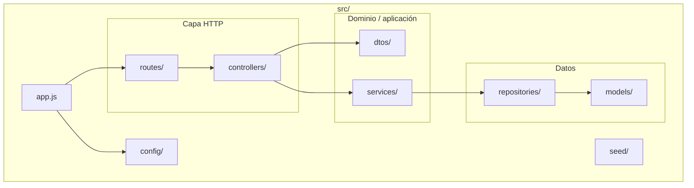
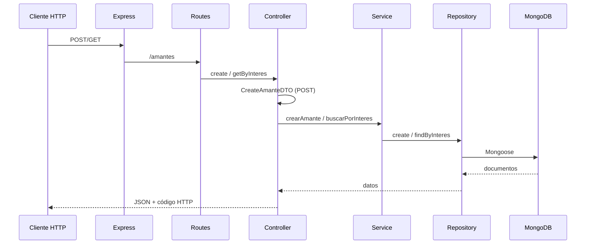
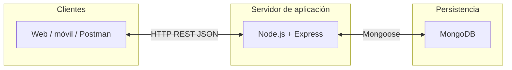

# Amante Ideal — Backend

API REST para el ejercicio #3 (*Amante ideal*): registro y consulta de “amantes” con intereses, persistidos en MongoDB.

---

## Prerrequisitos

| Requisito | Notas |
|-----------|--------|
| **Node.js** | Versión LTS recomendada (18.x o superior). Incluye `npm`. |
| **MongoDB** | Servidor en ejecución y accesible en la URI configurada en el código (por defecto `mongodb://127.0.0.1:27017/amantesDB`). |
| **Git** | Solo si clonas el repositorio. |

La dependencia `dotenv` está en el proyecto, pero la conexión actual está definida de forma fija en `src/config/database.js` (sin archivo `.env` obligatorio).

---

## Instalación

```bash
git clone https://github.com/ITCR-Diseno-de-software-2026-S1/Amante-Ideal---Backend.git
cd Amante-Ideal---Backend
npm install
```

Asegúrate de que **MongoDB** esté levantado antes de arrancar la API.

---

## Ejecución

| Comando | Descripción |
|---------|-------------|
| `npm run dev` | Servidor con **nodemon** (recarga al cambiar archivos). |
| `npm start` | Servidor con **Node** (`node src/app.js`). |

Por defecto la aplicación escucha en **http://localhost:3000**.

---

## Cómo probar

### Estado de pruebas automatizadas

El script `npm test` está definido como placeholder y **no ejecuta una suite de tests** (falla a propósito). Para validar el comportamiento se recomienda prueba manual o herramientas como Postman, Thunder Client o `curl`.

### Prueba manual rápida (curl)

1. **Crear un amante** (POST):

```bash
curl -X POST http://localhost:3000/amantes ^
  -H "Content-Type: application/json" ^
  -d "{\"nombre\":\"María\",\"edad\":22,\"intereses\":[\"cine\",\"lectura\"]}"
```

En PowerShell puedes usar `Invoke-RestMethod` o comillas simples externas según tu entorno.

2. **Buscar por interés** (GET, query `interes`):

```bash
curl "http://localhost:3000/amantes?interes=cine"
```

3. **Errores de validación** (400): por ejemplo, sin nombre, edad menor a 18 o `intereses` que no sea un arreglo.

### Datos de ejemplo (seed)

Existe `src/seed/seed.js` con datos de ejemplo, pero **no está integrado** al arranque de `app.js`. Si lo conectas o lo ejecutas manualmente tras conectar Mongoose, inserta registros solo si la colección está vacía.

---

## Estructura del proyecto

```
Amante-Ideal---Backend/
├── package.json
├── package-lock.json
└── src/
    ├── app.js                 # Punto de entrada: Express, CORS, JSON, rutas
    ├── config/
    │   └── database.js        # Conexión MongoDB (Mongoose)
    ├── controllers/
    │   └── amante.controller.js
    ├── dtos/
    │   └── createAmante.dto.js
    ├── models/
    │   └── amante.model.js    # Esquema Mongoose
    ├── repositories/
    │   └── amante.repository.js
    ├── routes/
    │   └── amantes.routes.js
    ├── services/
    │   └── amante.service.js
    └── seed/
        └── seed.js
```

### Diagrama (árbol lógico)



---

## Referencia de la API

**Base URL:** `http://localhost:3000`  
Prefijo de recursos: **`/amantes`**

| Método | Ruta | Descripción |
|--------|------|-------------|
| `POST` | `/amantes` | Crea un amante. |
| `GET` | `/amantes?interes=<texto>` | Lista amantes cuyo arreglo `intereses` contiene el valor indicado (coincidencia usada en el repositorio). |

### `POST /amantes`

**Cuerpo JSON:**

| Campo | Tipo | Reglas |
|-------|------|--------|
| `nombre` | string | Obligatorio. |
| `edad` | number | Obligatoria; debe ser ≥ 18. |
| `intereses` | array de strings | Obligatorio. |

**Respuestas típicas:**

- `201`: objeto creado (documento MongoDB / JSON).
- `400`: `{ "error": "<mensaje>" }` (validación del DTO).

### `GET /amantes?interes=...`

**Query:**

| Parámetro | Descripción |
|-----------|-------------|
| `interes` | Valor buscado dentro del arreglo `intereses`. |

**Respuesta:** `200` — arreglo JSON (puede ser vacío).

---

## Arquitectura

Se organiza en **capas** con responsabilidades separadas:

1. **Rutas** — Definen endpoints HTTP y delegan al controlador.
2. **Controladores** — Orquestan la petición/respuesta HTTP, validación vía DTO y llamadas al servicio.
3. **DTOs** — Objetos de transferencia y reglas de entrada para crear recursos.
4. **Servicios** — Lógica de aplicación (aquí delega en el repositorio).
5. **Repositorios** — Acceso a datos abstrayendo Mongoose.
6. **Modelos** — Esquema y modelo de Mongoose.

Flujo típico: **Cliente → Express → Ruta → Controlador → Servicio → Repositorio → MongoDB**.



---

## Paradigma de programación

- **Orientado a objetos (OOP)** en capas internas: clases para servicio, repositorio y DTO; instancias singleton exportadas (`module.exports = new ...`).
- **Programación asíncrona** con `async`/`await` para operaciones de red y base de datos.
- **Módulos CommonJS** (`require` / `module.exports`), acorde a `"type": "commonjs"` en `package.json`.
- **API REST** sobre HTTP con JSON; sin estado de sesión en el servidor para las operaciones descritas.

---

## Topología

- **Despliegue lógico:** aplicación **monolítica** en un solo proceso Node.js (un servicio API).
- **Comunicación:** cliente (navegador, app móvil, otro backend) ↔ **HTTP/JSON** ↔ **Express**.
- **Datos:** un único **MongoDB** como almacenamiento; topología de red típica **cliente/servidor en tres capas**: presentación (cliente), aplicación (Node), datos (MongoDB).



En entorno local todo suele ejecutarse en la misma máquina (`localhost`); en producción la API y MongoDB pueden estar en hosts distintos, manteniendo el mismo patrón lógico.

---

## Repositorio

- **Issues:** https://github.com/ITCR-Diseno-de-software-2026-S1/Amante-Ideal---Backend/issues  
- **Código:** https://github.com/ITCR-Diseno-de-software-2026-S1/Amante-Ideal---Backend
